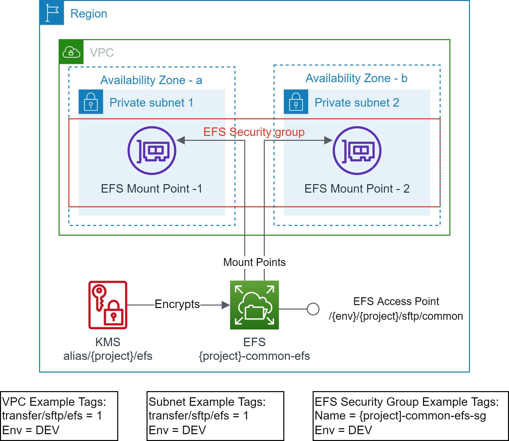

# Scenario1: Shared EFS and Shared EFS Access Point

This example provisions the resources to simulate the scenario1:

- EFS file system exists and optionally encrypted using KMS.
- EFS access point exists.
- EFS mount points exist in the target VPC Subnets.
- EFS Security Group exists and attached to the EFS mount points.

<p align="center"></p>

## Prerequisites

- Terraform backend provider and state locking providers are identified and bootstrapped.
  - A [bootstrap](../../../bootstrap) module/example is provided that provisions Amazon S3 for Terraform state storage and Amazon DynamoDB for Terraform state locking.
- The target VPC along with the target Subnets exist and identified via Tags.
  - A [vpc](../../../vpc) example is provided that provisions VPC, Subnets and related resources with example tagging.
  - The example uses the following tags to identify the target VPC and Subnets.
    ```text
    "transfer/sftp/efs" = "1"
    "Env"               = "DEV"
    ```

## Execution

- cd to `examples/efs/scenario1` folder.
- Modify the `backend "S3"` section in `provider.tf` with correct values for `region`, `bucket`, `dynamodb_table`, and `key`.
  - Use provided values as guidance.
- Modify `terraform.tfvars` to your requirements.
  - Use provided values as guidance.
- Make sure you are using the correct AWS Profile that has permission to provision the target resources.
  - `aws sts get-caller-identity`
- Execute `terraform init` to initialize Terraform.
- Execute `terraform plan` and verify the changes.
- Execute `terraform apply` and approve the changes to provision the resources.

<!-- BEGIN_TF_DOCS -->
## Requirements

| Name | Version |
|------|---------|
| <a name="requirement_terraform"></a> [terraform](#requirement\_terraform) | >= v1.1.9 |
| <a name="requirement_aws"></a> [aws](#requirement\_aws) | >= 4.13.0 |

## Providers

No providers.

## Modules

| Name | Source | Version |
|------|--------|---------|
| <a name="module_common_efs"></a> [common\_efs](#module\_common\_efs) | github.com/aws-samples/aws-tf-efs//modules/aws/efs | v1.0.0 |

## Resources

No resources.

## Inputs

| Name | Description | Type | Default | Required |
|------|-------------|------|---------|:--------:|
| <a name="input_env_name"></a> [env\_name](#input\_env\_name) | Environment name e.g. dev, prod | `string` | n/a | yes |
| <a name="input_project"></a> [project](#input\_project) | Project name (prefix/suffix) to be used on all the resources identification | `string` | n/a | yes |
| <a name="input_region"></a> [region](#input\_region) | The AWS Region e.g. us-east-1 for the environment | `string` | n/a | yes |
| <a name="input_subnet_tags"></a> [subnet\_tags](#input\_subnet\_tags) | Tags to discover target subnets in the VPC, these tags should identify one or more subnets | `map(string)` | n/a | yes |
| <a name="input_tags"></a> [tags](#input\_tags) | Common and mandatory tags for the resources | `map(string)` | n/a | yes |
| <a name="input_vpc_tags"></a> [vpc\_tags](#input\_vpc\_tags) | Tags to discover target VPC, these tags should uniquely identify a VPC | `map(string)` | n/a | yes |
| <a name="input_efs_access_point_specs"></a> [efs\_access\_point\_specs](#input\_efs\_access\_point\_specs) | List of EFS Access Point Specs to be created. It can be empty list. | <pre>list(object({<br>    efs_name        = string # unique name e.g. common<br>    efs_ap          = string # unique name e.g. common_sftp<br>    uid             = number<br>    gid             = number<br>    secondary_gids  = list(number)<br>    root_path       = string # e.g. /{env}/{project}/{purpose}/{name}<br>    owner_uid       = number # e.g. 0<br>    owner_gid       = number # e.g. 0<br>    root_permission = string # e.g. 0755<br>    principal_arns  = list(string)<br>  }))</pre> | `[]` | no |
| <a name="input_efs_id"></a> [efs\_id](#input\_efs\_id) | EFS File System Id, if not provided a new EFS will be created | `string` | `null` | no |
| <a name="input_kms_alias"></a> [kms\_alias](#input\_kms\_alias) | KMS Alias to discover KMS for EFS encryption, if not provided a new CMK will be created | `string` | `""` | no |
| <a name="input_security_group_tags"></a> [security\_group\_tags](#input\_security\_group\_tags) | Tags used to discover EFS Security Group, if not provided new EFS security group will be created | `map(string)` | `null` | no |

## Outputs

| Name | Description |
|------|-------------|
| <a name="output_efs"></a> [efs](#output\_efs) | Elastic File System info |
| <a name="output_efs_ap"></a> [efs\_ap](#output\_efs\_ap) | Elastic File System Access Points |
| <a name="output_efs_kms"></a> [efs\_kms](#output\_efs\_kms) | KMS Keys created for EFS |
<!-- END_TF_DOCS -->
