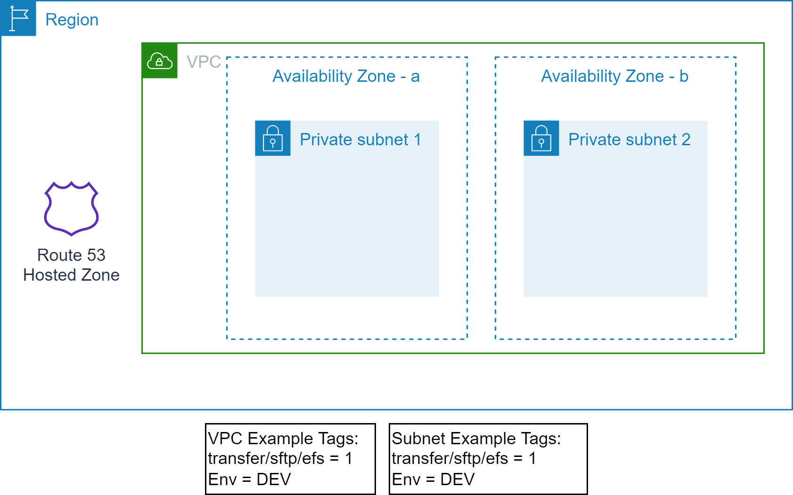

# Scenario3: Owned EFS and Owned EFS Access Point

This example assumes following resources are already provisioned:

- EFS file system does not exist. It is owned by the SFTP server.
- EFS access point does not exist. It is owned by the SFTP server.
- EFS mount points do not exist. It will be created along with the EFS.
- EFS Security Group does not exist. It will be created along with the EFS.
- The target VPC and Subnets exists and tagged for identification.

<p align="center"></p>

## Prerequisites

- Terraform backend provider and state locking providers are identified and bootstrapped.
  - An [example bootstrap](../../../bootstrap) module/example is provided that provisions Amazon S3 for Terraform state storage and Amazon DynamoDB for Terraform state locking.
- The target VPC along with the target Subnets exist and identified via Tags.
  - The example uses the following tags to identify the target VPC and Subnets.

    ```text
    "transfer/sftp/efs" = "1"
    "Env"               = "DEV"
    ```

- Create a [ssh key-pair](https://www.ssh.com/academy/ssh/keygen) for each SFTP client authentication. Or obtain the public key from the SFTP client.
  - Copy the public key(s) in the `users` folder e.g. `users/test.pub`
- Modify `terraform.tfvars` to match your requirements. Check the values for the following variables.
  - efs_id --> null, EFS will be created.
  - efs_ap_id --> null, EFA Access Point will be created.
  - efs_sg_tags --> null, EFS Security Group will be created.
  - efs_kms_alias --> "", EFS KMS CMK will be created, if required.
  - sftp_users --> list of users along with unique POSIX profile and `ssh` public key.
  - sftp_user_automation_subscribers --> list of email addresses.
  - sftp_daily_report_subscribers --> list of email addresses.

## Execution

- cd to `examples/sftp/scenario3` folder.
- Modify `backend "S3"` section in the `provider.tf` with correct values for `region`, `bucket`, `dynamodb_table`, and `key`.
  - Use provided values as guidance.
- Modify `terraform.tfvars` to your requirements.
  - Use provided values as guidance.
- Make sure you are using the correct AWS Profile that has permission to provision the target resources.
  - `aws sts get-caller-identity`
- Execute `terraform init` to initialize Terraform.
- Execute `terraform plan` and verify the changes.
- Execute `terraform apply` and approve the changes to provision the resources.
- The email subscribers must confirm the subscription to receive the status and the activity emails.

Use SFTP client of your choice to test the SFTP server.

<!-- BEGIN_TF_DOCS -->
## Providers

No providers.

## Modules

| Name | Source | Version |
|------|--------|---------|
| <a name="module_sftp"></a> [sftp](#module\_sftp) | ../../../modules/aws/transfer | n/a |

## Resources

No resources.

## Inputs

| Name | Description | Type | Default | Required |
|------|-------------|------|---------|:--------:|
| <a name="input_create_common_logs"></a> [create\_common\_logs](#input\_create\_common\_logs) | Create the common CW log groups | `bool` | `false` | no |
| <a name="input_efs_ap_id"></a> [efs\_ap\_id](#input\_efs\_ap\_id) | EFS File System Access Point Id, if not provided a new EFA Access Point will be created | `string` | `null` | no |
| <a name="input_efs_id"></a> [efs\_id](#input\_efs\_id) | EFS File System Id, if not provided a new EFS will be created | `string` | `null` | no |
| <a name="input_efs_kms_alias"></a> [efs\_kms\_alias](#input\_efs\_kms\_alias) | KMS Alias to discover KMS for EFS encryption, if not provided a new CMK will be created. If efs\_id is provided for the encrypted EFS, this must also be provided. | `string` | `""` | no |
| <a name="input_efs_sg_tags"></a> [efs\_sg\_tags](#input\_efs\_sg\_tags) | Tags used to discover EFS Security Group, if not provided new EFS security group will be created. If efs\_id is provided, this must also be provided. | `map(string)` | `null` | no |
| <a name="input_env_name"></a> [env\_name](#input\_env\_name) | Environment name e.g. dev, prod | `string` | n/a | yes |
| <a name="input_lambda_role"></a> [lambda\_role](#input\_lambda\_role) | Lambda Execution Role, if not provided a new IAM role will be created | `string` | `null` | no |
| <a name="input_logging_role"></a> [logging\_role](#input\_logging\_role) | SFTP Logging Role, if not provided a new IAM role will be created | `string` | `null` | no |
| <a name="input_project"></a> [project](#input\_project) | Project name (prefix/suffix) to be used on all the resources identification | `string` | n/a | yes |
| <a name="input_r53_zone_name"></a> [r53\_zone\_name](#input\_r53\_zone\_name) | Route 53 Zone Name. Optional, if provided, a DNS record will be created for the SFTP server | `string` | `""` | no |
| <a name="input_region"></a> [region](#input\_region) | The AWS Region e.g. us-east-1 for the environment | `string` | n/a | yes |
| <a name="input_server_name"></a> [server\_name](#input\_server\_name) | DNS compliant name, unique, SFTP Server Name | `string` | n/a | yes |
| <a name="input_sftp_daily_report_subscribers"></a> [sftp\_daily\_report\_subscribers](#input\_sftp\_daily\_report\_subscribers) | List of email address to which daily activity reports will be sent | `list(string)` | `[]` | no |
| <a name="input_sftp_encryptions"></a> [sftp\_encryptions](#input\_sftp\_encryptions) | Encryption specs for the SFTP server | <pre>object({<br>    encrypt_logs     = bool   # default false<br>    logs_kms_alias   = string # new CMK will be created, if needed<br>    encrypt_lambda   = bool   # default false<br>    lambda_kms_alias = string # new CMK will be created, if needed<br>    encrypt_sns      = bool   # default false<br>    sns_kms_alias    = string # new CMK will be created, if needed<br>  })</pre> | `null` | no |
| <a name="input_sftp_user_automation_subscribers"></a> [sftp\_user\_automation\_subscribers](#input\_sftp\_user\_automation\_subscribers) | List of email address to user automation information will be sent | `list(string)` | `[]` | no |
| <a name="input_sftp_users"></a> [sftp\_users](#input\_sftp\_users) | List of SFTP Users with POSIX profile and ssh key file | <pre>list(object({<br>    name         = string # unique name<br>    uid          = string # e.g. 3001<br>    gid          = string # e.g. 4000<br>    ssh_key_file = string # e.g. ./users/test.pub<br>  }))</pre> | n/a | yes |
| <a name="input_subnet_tags"></a> [subnet\_tags](#input\_subnet\_tags) | Tags to discover target subnets in the VPC, these tags should identify one or more subnets | `map(string)` | n/a | yes |
| <a name="input_tags"></a> [tags](#input\_tags) | Common and mandatory tags for the resources | `map(string)` | n/a | yes |
| <a name="input_user_role"></a> [user\_role](#input\_user\_role) | SFTP User Role, if not provided a new IAM role will be created | `string` | `null` | no |
| <a name="input_vpc_tags"></a> [vpc\_tags](#input\_vpc\_tags) | Tags to discover target VPC, these tags should uniquely identify a VPC | `map(string)` | n/a | yes |

## Outputs

| Name | Description |
|------|-------------|
| <a name="output_daily_report_subscribers"></a> [daily\_report\_subscribers](#output\_daily\_report\_subscribers) | Daily Report Subscribers |
| <a name="output_sftp_efs_ap"></a> [sftp\_efs\_ap](#output\_sftp\_efs\_ap) | Elastic File System ids |
| <a name="output_sftp_iam_role"></a> [sftp\_iam\_role](#output\_sftp\_iam\_role) | IAM Roles used by SFTP |
| <a name="output_sftp_kms"></a> [sftp\_kms](#output\_sftp\_kms) | KMS Keys created by SFTP |
| <a name="output_sftp_security_group"></a> [sftp\_security\_group](#output\_sftp\_security\_group) | Security Group used by SFTP Server |
| <a name="output_sftp_server"></a> [sftp\_server](#output\_sftp\_server) | Route 53 FQDN for SFTP Server |
| <a name="output_sftp_users"></a> [sftp\_users](#output\_sftp\_users) | SFTP Users |
| <a name="output_user_automation_subscribers"></a> [user\_automation\_subscribers](#output\_user\_automation\_subscribers) | User Automation Event Subscribers |
<!-- END_TF_DOCS -->
